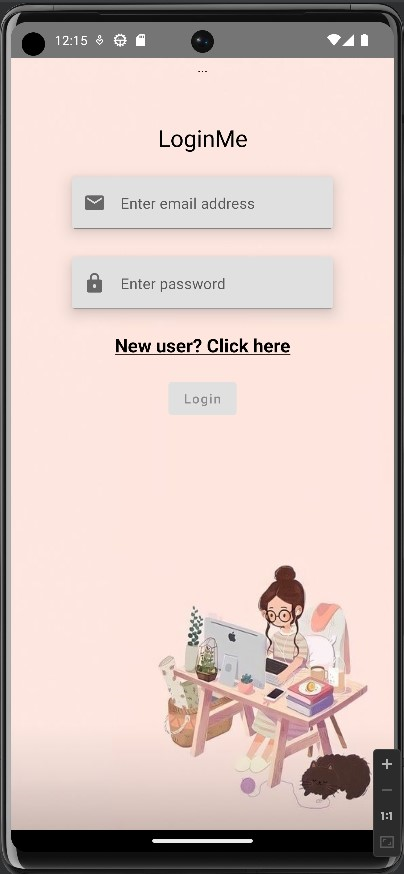
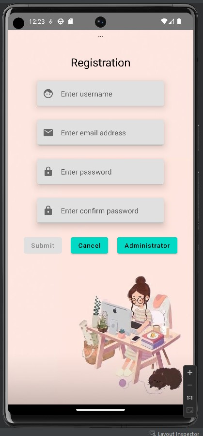
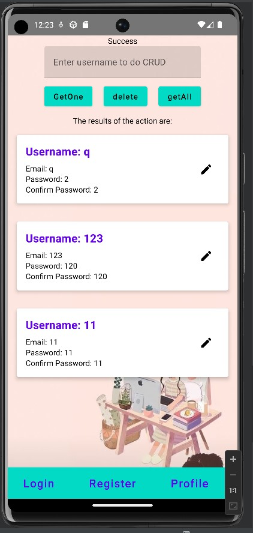
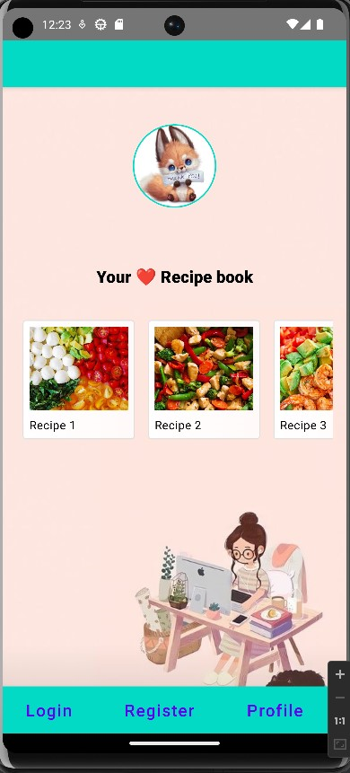

Welcome to my APP: Login/Registration

Features

* User authentication and login functionality
* User registration with form validation
* CRUD operations in the administrator page for managing user data
* Profile page displaying favorite recipe cards
...

Screenshots

Technologies Used
Kotlin
Jetpack Compose
Realm Database
Material Design Components

Installation
Clone the repository.
Open the project in your preferred IDE.
then install the required dependencies :  
plugins id("io.realm.kotlin") version "1.9.1".
Sourcesets/CommonMain/dependency
implementation("io.realm.kotlin:library-sync:1.9.1")

Usage

Login Page

Enter your credentials (Email and password) to log in.
If you don't have an account, click on the "New user? Click here" to navigate to the registration page.

Registration Page

Fill out the registration form with your desired username, email address, password, and confirm password.
Ensure that all fields are valid and meet the specified requirements for successful registration.
Click on the "Submit" button to create a new account.

Administrator Page

Access the administrator dashboard with the administrator button in Registration page.
Perform CRUD (Create, Read, Update, Delete) operations on user data.
Manage user accounts, update passwords, and delete user profiles.

Profile Page

View your profile information, including your email address and favorite recipe cards.
Edit your profile details and update your password if needed.
Explore and interact with the displayed recipe cards.

Development

To contribute to the project, follow these steps:

Clone the repository to your local machine.
Open the project in your preferred IDE.
Install the required dependencies and plugins:
plugins id("io.realm.kotlin") version "1.9.1"
Sourcesets/CommonMain/dependency
implementation("io.realm.kotlin:library-sync:1.9.1")
Make necessary changes and improvements.
Ensure that the code follows the established coding conventions.
Test your changes thoroughly.
Submit a pull request with a detailed explanation of the proposed changes.

License

This project is licensed under the MIT License.

Contact Information

For any questions or support, please contact 2267127@johnabbottcollege.net.